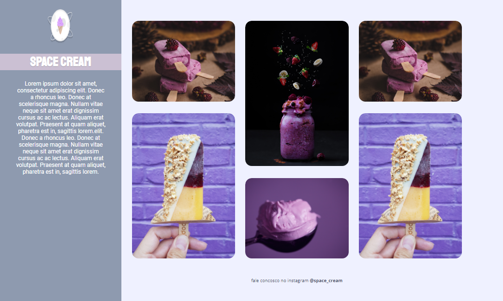

<strong> <h1 align="center"> SPACE CREAM</h1></strong>

## 🚀 Tecnologias

Esse projeto foi desenvolvido com as seguintes tecnologias:

- HTML
- CSS
- Git e Github

## 🏷️ Layout

Você pode visualizar o layoout do projeto através
[desse link](https://www.figma.com/file/sHbrXhuIYkmVBNz9w0DRjn/Stage-03---Grid-com-anima%C3%A7%C3%B5es-(Copy)?type=design&node-id=0-3&mode=design&t=A3RdiLsZHhUiFyDz-0).
É necessário ter uma conta no [Figma](https://www.figma.com)